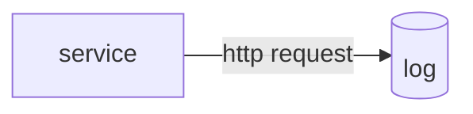
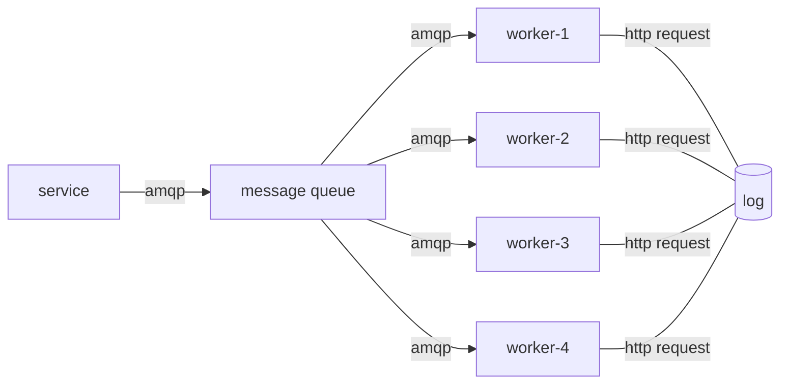

# queue

# 1. task loop

```mermaid
graph LR
    S["service"] -->|"http request"| L[("log")]
```
# 2. task queue

```mermaid
graph LR
    S["service"] -->|amqp| Q["message queue"]
    Q -->|amqp| W1["worker-1"]
    Q -->|amqp| W2["worker-2"]
    Q -->|amqp| W3["worker-3"]
    Q -->|amqp| W4["worker-4"]
    W1 ---|"http request"| L[("log")]
    W2 ---|"http request"| L
    W3 ---|"http request"| L
    W4 ---|"http request"| L
```